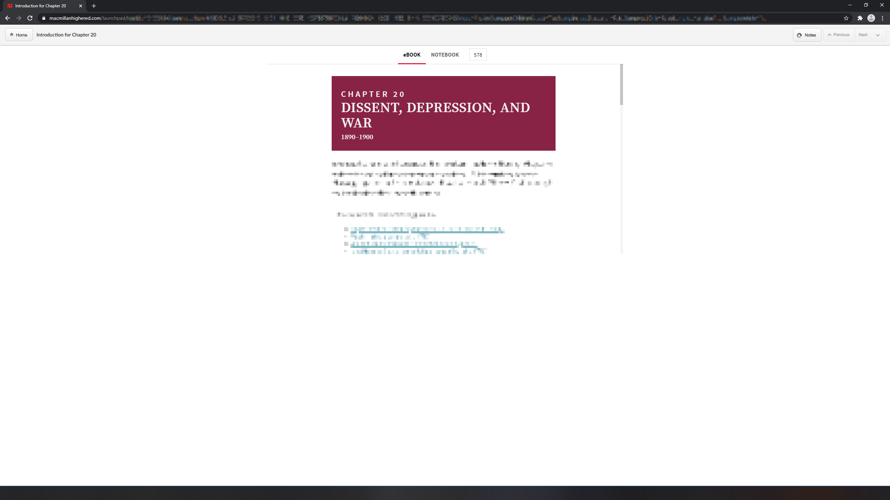

	<h1>Launchpad Fixer </h1>

## About
Macmillan's Launchpad online textbook service has an issue where the site only displays ~730 vertical pixels at a time regardless of display resolution. 

This causes the site to waste a lot of space on high resolution displays:

This chrome extension just modifies the site's style to make the textbook take up the full window:

N.B. *some parts of the screen have been blurred to remove identifying information and copyrighted material*

### Extra Notes
- This extension won't do anything for a chrome window ~730 pixels or less in height.
- The site still has the reverse issue of the textbook viewport taking up too much of the screen at resolutions below the ~730 limit.
- I haven't yet listed this extension on the chrome web store.